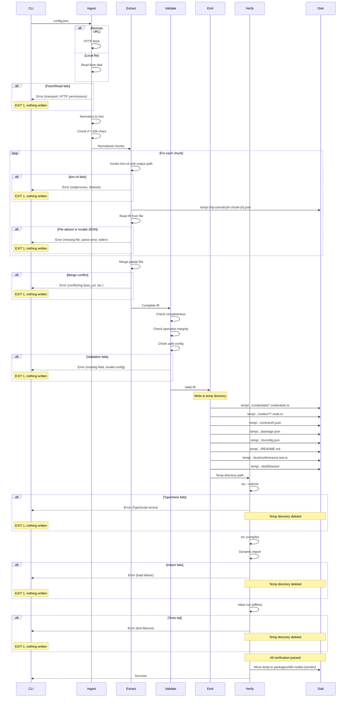

# Design Document: Documentation-to-Node Generation

## Overview

The driftnode generator transforms prose API documentation into publishable n8n community node packages with conformance tests. The design follows a five-stage pipeline: Ingest, Extract, Validate, Emit, Verify. Each stage can terminate early on error, preventing invalid output from reaching disk.

The critical artifact is the Intermediate Representation (IR), a structured contract that bridges extraction (reading prose) and emission (writing code). The IR is serialized to `contract/ir.json` and serves as the contract for both the generated node and its conformance test.

## Architecture

### Five-Stage Pipeline

The generator operates as a linear pipeline with early termination on error:



### Key Design Decisions

1. **Atomic generation via temporary directory**: All output is written to a temporary directory. The final step is a single atomic move to `packages/n8n-nodes-{vendor}/`. Failed runs never leave partial artifacts in the workspace.

2. **IR as the contract boundary**: The IR is the ONLY interface between extraction and emission. Extraction knows nothing about n8n. Emission knows nothing about Kiro. This isolation enables future extraction backends (OpenAPI, Postman collections) and future emission targets (other automation platforms).

3. **Zero runtime imports from generator to generated package**: The generated package has no dependency on driftnode. The conformance test reads `contract/ir.json` directly. This ensures the generated package can be published and tested independently.

4. **Early termination, late commit**: The pipeline validates aggressively before writing anything permanent. Errors in extraction, validation, typechecking, or testing terminate immediately without side effects.

## Components and Interfaces

### Module Structure

The generator is structured as 6 modules in `packages/driftnode/src/`:

1. **`cli.ts`**: Entry point. Parses config, orchestrates pipeline, handles process exit codes.

2. **`ingest.ts`**: Fetches or reads documentation, normalizes to text, splits into chunks. Exports:
   - `type DocumentSource = { type: 'url', url: string } | { type: 'file', path: string }`
   - `type DocumentChunk = { content: string, start: number, end: number }`
   - `function ingest(source: DocumentSource): Promise<DocumentChunk[]>`

3. **`extract.ts`**: Invokes kiro-cli with file handoff, reads PartialIR files, merges into complete IR. Exports:
   - `type PartialIR` (see full definition below)
   - `type IntermediateRepresentation` (see full definition below)
   - `function extract(chunks: DocumentChunk[], config: Config, tempDir: string): Promise<IntermediateRepresentation>`

4. **`validate.ts`**: Validates IR completeness, operation integrity, auth config. Exports:
   - `function validate(ir: IntermediateRepresentation): ValidationResult`
   - `type ValidationResult = { valid: true } | { valid: false, errors: ValidationError[] }`

5. **`emit.ts`**: Generates all package files to a temporary directory. Exports:
   - `function emit(ir: IntermediateRepresentation, tempDir: string): Promise<void>`

6. **`verify.ts`**: Typechecks, loads, tests, then moves temp directory into place. Exports:
   - `function verify(tempDir: string, targetDir: string): Promise<void>`

This structure keeps the pipeline linear and testable. Each module has a single responsibility and clear input/output types.

### The Intermediate Representation (IR)

The IR is the MOST IMPORTANT type in the system. It carries the complete vendor API contract extracted from documentation. It must be rich enough to generate both the node implementation and the conformance test.

#### Partial IR (Per-Chunk Output)

```typescript
/**
 * Partial Intermediate Representation: what Kiro writes per documentation chunk.
 * base_url and auth are optional because they may not appear in every chunk.
 * source and schema_version are absent because they are generator-owned metadata.
 */
export interface PartialIR {
  /**
   * Vendor API base URL if found in this chunk
   */
  base_url?: string;

  /**
   * Authentication configuration if found in this chunk
   */
  auth?: AuthenticationScheme;

  /**
   * Resources found in this chunk (empty array if chunk contains no endpoints)
   */
  resources: Resource[];

  /**
   * Extension point for pagination (deferred)
   */
  pagination?: PaginationConfig;
}
```

#### Complete IR (After Merge)

```typescript
/**
 * Intermediate Representation: the structured contract extracted from
 * vendor API documentation. This is the boundary between extraction and emission.
 */
export interface IntermediateRepresentation {
  /**
   * Schema version for backward compatibility as IR evolves
   */
  schema_version: '1.0.0';

  /**
   * Source documentation metadata
   */
  source: {
    /**
     * URL if fetched remotely, undefined if read from local file
     */
    url?: string;
    
    /**
     * Absolute path if read from local file, undefined if fetched remotely
     */
    path?: string;
    
    /**
     * SHA-256 hash of normalized documentation content.
     * Used by conformance test to detect documentation changes.
     */
    content_hash: string;
    
    /**
     * Timestamp when the IR was extracted (ISO 8601)
     */
    extracted_at: string;
  };

  /**
   * Vendor API base URL (e.g., "https://api.vultr.com/v2")
   */
  base_url: string;

  /**
   * Authentication configuration
   */
  auth: AuthenticationScheme;

  /**
   * Resources exposed by the API (e.g., "instances", "ssh-keys")
   */
  resources: Resource[];

  /**
   * Extension point for pagination extraction (Requirement 11, deferred)
   */
  pagination?: PaginationConfig;
}

/**
 * Authentication scheme extracted from documentation
 */
export type AuthenticationScheme =
  | {
      type: 'api_key';
      location: 'header';
      header_name: string;
    }
  | {
      type: 'api_key';
      location: 'query';
      query_param_name: string;
    }
  | {
      type: 'api_key';
      location: 'body';
      body_field_name: string;
    }
  | {
      type: 'bearer_token';
      header_name: string; // Defaults to "Authorization"
    }
  | {
      type: 'basic';
    }
  | {
      type: 'oauth2';
      authorize_url: string;
      token_url: string;
      scopes?: string[];
    };

/**
 * A resource in the vendor API (e.g., "instances", "ssh-keys")
 */
export interface Resource {
  /**
   * Resource identifier (kebab-case, e.g., "ssh-keys")
   */
  name: string;

  /**
   * Human-readable display name (e.g., "SSH Keys")
   */
  display_name: string;

  /**
   * Description extracted from documentation
   */
  description: string;

  /**
   * Operations available on this resource
   */
  operations: Operation[];
}

/**
 * An operation on a resource (e.g., "list", "create", "delete")
 */
export interface Operation {
  /**
   * Operation identifier (kebab-case, e.g., "list-instances")
   */
  name: string;

  /**
   * Human-readable display name (e.g., "List Instances")
   */
  display_name: string;

  /**
   * Description extracted from documentation
   */
  description: string;

  /**
   * HTTP method
   */
  http_method: 'GET' | 'POST' | 'PUT' | 'PATCH' | 'DELETE';

  /**
   * URL path with parameter placeholders (e.g., "/instances/{instance-id}")
   */
  path: string;

  /**
   * Parameters accepted by this operation
   */
  parameters: Parameter[];

  /**
   * Response structure
   */
  response_shape: ResponseShape;

  /**
   * Example request/response pairs extracted from documentation
   */
  examples: Example[];

  /**
   * Extension point for pagination (Requirement 11, deferred)
   */
  pagination?: OperationPagination;
}

/**
 * A parameter for an operation
 */
export interface Parameter {
  /**
   * Parameter name (e.g., "instance_id", "label")
   */
  name: string;

  /**
   * Human-readable display name (e.g., "Instance ID")
   */
  display_name: string;

  /**
   * Description extracted from documentation
   */
  description: string;

  /**
   * Where the parameter appears in the request
   */
  location: 'path' | 'query' | 'header' | 'body';

  /**
   * Parameter type
   */
  type: ParameterType;

  /**
   * Whether this parameter is required
   */
  required: boolean;

  /**
   * Default value if documented, undefined otherwise
   */
  default_value?: string | number | boolean;

  /**
   * Validation constraints extracted from documentation
   */
  constraints?: ParameterConstraints;
}

/**
 * Parameter types supported by n8n
 */
export type ParameterType =
  | { kind: 'string' }
  | { kind: 'number' }
  | { kind: 'integer' }
  | { kind: 'boolean' }
  | { kind: 'array'; items_type: ParameterType }
  | { kind: 'object'; properties: Record<string, ParameterType> };

/**
 * Validation constraints for parameters
 */
export interface ParameterConstraints {
  /**
   * Enum values if parameter is an enum
   */
  enum?: Array<string | number>;

  /**
   * Minimum length for strings (only if documented)
   */
  min_length?: number;

  /**
   * Maximum length for strings (only if documented)
   */
  max_length?: number;

  /**
   * Regex pattern for strings (only if documented)
   */
  pattern?: string;

  /**
   * Minimum value for numbers (only if documented)
   */
  minimum?: number;

  /**
   * Maximum value for numbers (only if documented)
   */
  maximum?: number;

  /**
   * Minimum items for arrays (only if documented)
   */
  min_items?: number;

  /**
   * Maximum items for arrays (only if documented)
   */
  max_items?: number;
}

/**
 * Response structure for an operation
 */
export interface ResponseShape {
  /**
   * Top-level response type
   */
  type: 'object' | 'array' | 'primitive';

  /**
   * Properties if type is 'object'
   */
  properties?: Record<string, PropertyShape>;

  /**
   * Item type if type is 'array'
   */
  items_type?: ResponseShape;

  /**
   * Primitive type if type is 'primitive'
   */
  primitive_type?: 'string' | 'number' | 'boolean' | 'null';

  /**
   * Flag indicating the response shape is undocumented or ambiguous.
   * When true, the conformance test skips response shape verification
   * for this operation.
   */
  undocumented: boolean;
}

/**
 * A property in an object response
 */
export interface PropertyShape {
  /**
   * Property type
   */
  type: 'string' | 'number' | 'boolean' | 'array' | 'object' | 'null';

  /**
   * Whether this property is required in the response
   */
  required: boolean;

  /**
   * Description extracted from documentation
   */
  description?: string;

  /**
   * Nested properties if type is 'object'
   */
  properties?: Record<string, PropertyShape>;

  /**
   * Item type if type is 'array'
   */
  items_type?: PropertyShape;
}

/**
 * Example request/response pair
 */
export interface Example {
  /**
   * Example name or description
   */
  name: string;

  /**
   * Request parameters
   */
  request: Record<string, unknown>;

  /**
   * Response body
   */
  response: unknown;

  /**
   * HTTP status code
   */
  status_code: number;
}

/**
 * Extension point for pagination support (Requirement 11, deferred)
 */
export interface PaginationConfig {
  /**
   * Default pagination style across all operations
   */
  default_style: 'cursor' | 'offset' | 'page' | 'none';
}

/**
 * Extension point for per-operation pagination (Requirement 11, deferred)
 */
export interface OperationPagination {
  /**
   * Pagination style for this operation (overrides default)
   */
  style: 'cursor' | 'offset' | 'page' | 'none';

  /**
   * Cursor-based pagination config
   */
  cursor?: {
    cursor_param: string;
    next_cursor_field: string;
  };

  /**
   * Offset-based pagination config
   */
  offset?: {
    limit_param: string;
    offset_param: string;
  };

  /**
   * Page-based pagination config
   */
  page?: {
    page_param: string;
    page_size_param: string;
  };
}
```

#### Merging Partial IRs

The merge step consumes `PartialIR[]` and produces a complete `IntermediateRepresentation`. This is the boundary where partial becomes complete.

**Merge Strategy:**

- **base_url**: First non-undefined value wins. If multiple chunks provide different base_url values, that is a merge conflict error.

- **auth**: First non-undefined value wins. If multiple chunks provide different authentication scheme types (e.g., one says api_key, another says oauth2), that is a merge conflict error.

- **resources**: Union by name. If the same resource name appears in multiple chunks, the operations are merged. Operations within a resource are unioned by name.

- **Operation conflicts**: If two chunks define the same operation name within a resource but with different `http_method` or `path`, that is a hard error. Operations must be consistent across chunks.

- **Generator-owned metadata**: After merging, the generator computes and adds:
  - `source.content_hash`: SHA-256 hash of the full normalized documentation (not per-chunk)
  - `source.extracted_at`: ISO 8601 timestamp of the generation run
  - `schema_version`: "1.0.0"

**Note:** Source metadata (content_hash, extracted_at) is generator-owned and computed in Node after reading chunk files back. The content_hash is computed over the full normalized documentation (not per-chunk), and extracted_at is set once per generation run. An LLM cannot compute SHA-256 correctly and model-generated timestamps break determinism.

**Validation Timing:** The merged IR is validated as a whole. Errors like `missing_base_url` and `missing_auth_scheme` belong to the merge/validate boundary, not extraction per se. A chunk that contains no base_url is valid; a complete IR with no base_url is not.

### Error Taxonomy

The design implements layered error precedence as specified in Requirements 1 and 2. When multiple error conditions exist, the generator reports only the highest-priority error from the appropriate layer.

```typescript
/**
 * Error taxonomy with layered precedence
 */
export type GeneratorError =
  // Ingest stage: Remote fetch errors (Requirement 1)
  | { stage: 'ingest', type: 'network_error', url: string, message: string }
  | { stage: 'ingest', type: 'timeout', url: string, timeout_seconds: number }
  | { stage: 'ingest', type: 'auth_denied', url: string, status_code: 401 | 403 }
  | { stage: 'ingest', type: 'not_found', url: string }
  | { stage: 'ingest', type: 'http_error', url: string, status_code: number }
  | { stage: 'ingest', type: 'unsupported_content_type', url: string, content_type: string }
  | { stage: 'ingest', type: 'empty_response', url: string }
  
  // Ingest stage: Local file errors (Requirement 2)
  | { stage: 'ingest', type: 'file_not_found', path: string }
  | { stage: 'ingest', type: 'permission_denied', path: string }
  | { stage: 'ingest', type: 'empty_file', path: string }
  | { stage: 'ingest', type: 'unsupported_extension', path: string, extension: string }
  
  // Extract stage errors (Requirements 5, 10)
  | { stage: 'extract', type: 'kiro_not_found' }
  | { stage: 'extract', type: 'kiro_timeout', timeout_seconds: number }
  | { stage: 'extract', type: 'kiro_failed', exit_code: number, stderr: string }
  | { stage: 'extract', type: 'ir_file_missing', chunk_index: number, expected_path: string, stderr: string }
  | { stage: 'extract', type: 'ir_file_empty', chunk_index: number, path: string }
  | { stage: 'extract', type: 'invalid_ir_json', chunk_index: number, path: string, parse_error: string }
  | { stage: 'extract', type: 'merge_conflict', field: string, values: unknown[], chunk_indices: number[] }
  
  // Validate stage errors (Requirements 12, 13, 14)
  | { stage: 'validate', type: 'missing_base_url' }
  | { stage: 'validate', type: 'missing_auth_scheme' }
  | { stage: 'validate', type: 'empty_resources' }
  | { stage: 'validate', type: 'empty_operations', resource: string }
  | { stage: 'validate', type: 'missing_http_method', resource: string, operation: string }
  | { stage: 'validate', type: 'missing_path', resource: string, operation: string }
  | { stage: 'validate', type: 'path_param_not_defined', resource: string, operation: string, param: string }
  | { stage: 'validate', type: 'no_body_params', resource: string, operation: string, http_method: 'POST' | 'PUT' }
  | { stage: 'validate', type: 'missing_api_key_header_name' }
  | { stage: 'validate', type: 'missing_api_key_query_param_name' }
  | { stage: 'validate', type: 'missing_oauth2_urls', missing: Array<'authorize_url' | 'token_url'> }
  
  // Verify stage errors (Requirements 25, 26, 27)
  | { stage: 'verify', type: 'typecheck_failed', errors: string[] }
  | { stage: 'verify', type: 'import_failed', error: string }
  | { stage: 'verify', type: 'missing_node_property', property: string }
  | { stage: 'verify', type: 'test_failed', failures: string[] };
```

**Precedence implementation:**

The ingest module implements precedence by checking conditions in order and returning immediately on the first match:

```typescript
// Remote fetch precedence (Requirement 1)
async function fetchRemote(url: string): Promise<DocumentChunk[] | GeneratorError> {
  try {
    const response = await fetch(url, { timeout: 30000 });
    
    // HTTP status layer (after transport succeeds)
    if (response.status === 401 || response.status === 403) {
      return { stage: 'ingest', type: 'auth_denied', url, status_code: response.status };
    }
    if (response.status === 404) {
      return { stage: 'ingest', type: 'not_found', url };
    }
    if (!response.ok) {
      return { stage: 'ingest', type: 'http_error', url, status_code: response.status };
    }
    
    // Payload layer (after HTTP succeeds)
    const contentType = response.headers.get('content-type');
    if (!isSupportedContentType(contentType)) {
      return { stage: 'ingest', type: 'unsupported_content_type', url, content_type: contentType };
    }
    
    const body = await response.text();
    if (body.length === 0) {
      return { stage: 'ingest', type: 'empty_response', url };
    }
    
    return normalize(body);
    
  } catch (error) {
    // Transport layer (highest priority, caught first)
    if (error.code === 'ETIMEDOUT') {
      return { stage: 'ingest', type: 'timeout', url, timeout_seconds: 30 };
    }
    return { stage: 'ingest', type: 'network_error', url, message: error.message };
  }
}

// Local file precedence (Requirement 2)
async function readLocal(path: string): Promise<DocumentChunk[] | GeneratorError> {
  // File existence layer (highest priority)
  if (!fs.existsSync(path)) {
    return { stage: 'ingest', type: 'file_not_found', path };
  }
  
  // Permissions layer
  try {
    await fs.promises.access(path, fs.constants.R_OK);
  } catch {
    return { stage: 'ingest', type: 'permission_denied', path };
  }
  
  const content = await fs.promises.readFile(path, 'utf-8');
  
  // Empty file layer
  if (content.length === 0) {
    return { stage: 'ingest', type: 'empty_file', path };
  }
  
  // Extension layer (lowest priority)
  const ext = extname(path);
  if (!['.html', '.md', '.txt', '.json'].includes(ext)) {
    return { stage: 'ingest', type: 'unsupported_extension', path, extension: ext };
  }
  
  return normalize(content);
}
```

This structure ensures only the highest-priority error is reported when multiple conditions exist.

### Extraction Prompt

The extraction prompt is the highest-leverage string in the system. It instructs Kiro to extract the vendor API contract from documentation and write it as structured IR to a file.

**Invocation:**

```bash
kiro-cli chat --no-interactive --trust-tools=read,write
```

**Prompt text:**

```
You are an API documentation parser. Your task is to extract a structured contract from the following API documentation and write it as valid JSON to the file path I specify.

# Documentation Chunk

{documentation_chunk}

# Output Schema

Use this TypeScript interface as your output schema:

{PartialIR_type_definition}

# Instructions

1. Extract the following from the documentation (if present in this chunk):
   - base_url: The API base URL (e.g., "https://api.vultr.com/v2")
   - auth: Authentication scheme (type, location, header/query/body field names)
   - resources: All resources mentioned (e.g., "instances", "ssh-keys")
   
   If this chunk does not contain base_url or auth information, omit those fields.

2. For each resource, extract:
   - name: kebab-case identifier
   - display_name: Human-readable name
   - description: Summary from documentation
   - operations: All operations available on this resource

3. For each operation, extract:
   - name: kebab-case identifier
   - display_name: Human-readable name
   - description: Summary from documentation
   - http_method: GET | POST | PUT | PATCH | DELETE
   - path: URL path with {parameter} placeholders
   - parameters: All documented parameters
   - response_shape: Structure of successful responses
   - examples: Any request/response examples shown in documentation

4. For parameters, extract:
   - name, display_name, description
   - location: path | query | header | body
   - type: The parameter type (string, number, boolean, array, object)
   - required: Whether the parameter is required
   - default_value: Default value if documented
   - constraints: Any validation rules (enum, min/max length, pattern)

5. For response shapes:
   - If the documentation clearly describes the response structure, extract it fully
   - If the response structure is ambiguous or undocumented, set `undocumented: true`
   - Include property types and whether they are required

6. Extract ONLY what is explicitly documented. Do NOT:
   - Infer or assume values
   - Add default values not in the documentation
   - Guess at parameter types
   - Invent response structures
   - Include source metadata (content_hash, extracted_at)
   - Include schema_version

7. Write the extracted PartialIR as valid JSON to this file path:
   {output_file_path}

Use the fs_write tool to write the file. The JSON must be valid and parseable. Do NOT include conversational text in the file—only the JSON object.

If this documentation chunk contains no endpoints, write {"resources": []} which is valid.
```

**File Handoff Protocol:**

1. The generator creates a temporary directory `.tmp-{vendor}/` in the workspace
2. For each documentation chunk `n`, the generator constructs the output path: `.tmp-{vendor}/ir-chunk-{n}.json`
3. The generator invokes kiro-cli with the prompt containing the chunk and the output path
4. The generator waits for kiro-cli to exit
5. If exit code is non-zero, the generator reads stderr and reports `{ stage: 'extract', type: 'kiro_failed', exit_code, stderr }`
6. If exit code is zero, the generator reads the file at the output path
7. If the file is absent: `{ stage: 'extract', type: 'ir_file_missing', chunk_index: n, expected_path, stderr }`
8. If the file is empty: `{ stage: 'extract', type: 'ir_file_empty', chunk_index: n, path }`
9. If JSON.parse fails: `{ stage: 'extract', type: 'invalid_ir_json', chunk_index: n, path, parse_error }`
10. If parse succeeds, the generator adds the `PartialIR` to the merge set

After all chunks are processed, the generator merges the `PartialIR[]` into a complete `IntermediateRepresentation`:
- Combines base_url and auth (first non-undefined wins, conflicts are errors)
- Unions resources by name
- Computes and adds source metadata (content_hash over full normalized docs, extracted_at timestamp)
- Adds schema_version: "1.0.0"

This protocol eliminates all ambiguity: either the file exists with valid JSON, or extraction failed completely.

## Data Models

### Configuration File

The user provides a configuration file specifying what to generate:

```typescript
export interface GeneratorConfig {
  /**
   * Vendor name (kebab-case, e.g., "vultr")
   */
  vendor: string;

  /**
   * Documentation source
   */
  documentation: DocumentSource;

  /**
   * Resources and operations to include.
   * If omitted, all discovered resources are included.
   */
  include?: {
    /**
     * Resource name as it appears in documentation
     */
    resource: string;
    
    /**
     * Operations to include. If omitted, all operations for the resource are included.
     */
    operations?: string[];
  }[];
}
```

Example:

```json
{
  "vendor": "vultr",
  "documentation": {
    "type": "url",
    "url": "https://www.vultr.com/api/"
  },
  "include": [
    {
      "resource": "instances",
      "operations": ["list", "create", "get", "delete"]
    },
    {
      "resource": "ssh-keys"
    }
  ]
}
```

### Atomic Generation Strategy

The emit stage writes all files to a temporary directory. The verify stage performs all checks against the temporary directory. Only after all verification passes does the verify stage move the temporary directory into place.

```typescript
// In verify.ts
export async function verify(tempDir: string, targetDir: string): Promise<void> {
  // Step 1: Typecheck
  const typecheckResult = await runTypecheck(tempDir);
  if (!typecheckResult.success) {
    await fs.promises.rm(tempDir, { recursive: true });
    throw new Error(`Typecheck failed:\n${typecheckResult.errors.join('\n')}`);
  }

  // Step 2: Compile
  const compileResult = await runCompile(tempDir);
  if (!compileResult.success) {
    await fs.promises.rm(tempDir, { recursive: true });
    throw new Error(`Compile failed:\n${compileResult.errors.join('\n')}`);
  }

  // Step 3: Dynamic import
  const importResult = await dynamicImport(tempDir);
  if (!importResult.success) {
    await fs.promises.rm(tempDir, { recursive: true });
    throw new Error(`Import failed: ${importResult.error}`);
  }

  // Step 4: Verify node structure
  const structureResult = verifyNodeStructure(importResult.nodeClass);
  if (!structureResult.success) {
    await fs.promises.rm(tempDir, { recursive: true });
    throw new Error(`Node structure invalid: ${structureResult.errors.join(', ')}`);
  }

  // Step 5: Run tests (offline, no vendor credentials)
  const testResult = await runTests(tempDir);
  if (!testResult.success) {
    await fs.promises.rm(tempDir, { recursive: true });
    throw new Error(`Tests failed:\n${testResult.failures.join('\n')}`);
  }

  // Step 6: All verification passed, move into place
  // If targetDir exists, remove it first (idempotent regeneration)
  if (fs.existsSync(targetDir)) {
    await fs.promises.rm(targetDir, { recursive: true });
  }

  // Atomic move (rename is atomic on same filesystem)
  await fs.promises.rename(tempDir, targetDir);
}
```

This design ensures failed generation never leaves partial output in the workspace. The temporary directory is either fully promoted or fully deleted.

## Correctness Properties

*A property is a characteristic or behavior that should hold true across all valid executions of a system—essentially, a formal statement about what the system should do. Properties serve as the bridge between human-readable specifications and machine-verifiable correctness guarantees.*

Property-based testing is NOT appropriate for this feature. The generator is primarily:
- **Infrastructure-like code**: It shells out to kiro-cli, writes files, compiles TypeScript, and runs subprocesses
- **Configuration transformation**: It reads a config file and produces a package structure
- **Integration-heavy**: Most operations involve external tools (kiro-cli, tsc, vitest) or filesystem I/O

The correctness guarantees are better validated through:
- **Example-based unit tests**: Specific documentation inputs with known-good IR outputs
- **Integration tests**: End-to-end generation from sample vendor docs
- **Snapshot tests**: Comparing generated package structure against committed snapshots

## Error Handling

### Error Reporting Strategy

Each stage returns either a success result or a `GeneratorError`. The CLI module formats errors for human consumption:

```typescript
function formatError(error: GeneratorError): string {
  switch (error.stage) {
    case 'ingest':
      return formatIngestError(error);
    case 'extract':
      return formatExtractError(error);
    case 'validate':
      return formatValidateError(error);
    case 'verify':
      return formatVerifyError(error);
  }
}
```

Example formatted error:

```
Error: Documentation fetch failed

  URL: https://api.example.com/docs
  Status: 404 Not Found

The documentation URL returned a 404 error. Verify the URL is correct
and the documentation is publicly accessible.
```

### Error Recovery

The generator does NOT attempt to recover from errors. When an error occurs, the generator terminates immediately with a non-zero exit code. This fail-fast approach ensures:

1. Invalid state never propagates downstream
2. Users receive clear, actionable feedback
3. Debugging is straightforward (no partial state to reason about)

The only exception is validation warnings (e.g., POST operation with no body parameters), which are logged but do not terminate generation.

## Testing Strategy

The testing strategy distinguishes between testing the generator itself and testing the generated output.

### Testing the Generator (packages/driftnode/test)

These tests validate that the generator produces correct output from given inputs.

**Unit Tests:**
- `ingest.test.ts`: Test normalization, chunking, error precedence
- `extract.test.ts`: Test IR merging, conflict detection (mock kiro-cli)
- `validate.test.ts`: Test completeness checks, operation integrity
- `emit.test.ts`: Test file generation from sample IRs
- `verify.test.ts`: Test verification steps (mock tsc, vitest)

**Integration Tests:**
- `e2e.test.ts`: End-to-end generation from sample vendor documentation to complete package
- Uses fixture documentation (small HTML/Markdown samples)
- Mocks kiro-cli with predetermined IR outputs
- Validates generated package structure matches snapshots

**Property-Based Tests:**
None. The generator is not suitable for PBT (see Correctness Properties section).

### Testing Generated Output (packages/n8n-nodes-{vendor}/test)

These tests validate that the generated node works correctly. They are part of the generated package and must run without the generator present.

**Conformance Test (`conformance.test.ts`):**
- Reads `contract/ir.json` directly (NOT imported from generator)
- When vendor API key is present: validates live API against IR
- When vendor API key is absent: skips and logs warning
- Validates HTTP methods, paths, response shapes
- Fails if required response fields are missing
- Warns if live API returns undocumented fields

**Unit Tests (`unit.test.ts`):**
- Tests individual operations in offline fixture mode
- Validates parameter validation logic
- Validates error mapping
- Runs without vendor credentials

**Fixture Management:**
Fixtures are JSON files in `test/fixtures/`. Each fixture is named `{resource}-{operation}-{param-hash}.json` and contains:

```json
{
  "request": {
    "method": "GET",
    "path": "/instances/12345",
    "headers": {},
    "query": {},
    "body": null
  },
  "response": {
    "status": 200,
    "headers": {
      "content-type": "application/json"
    },
    "body": {
      "instance": {
        "id": "12345",
        "label": "test-instance"
      }
    }
  }
}
```

The fixture loader in the generated package reads these files and returns mock responses, enabling offline testing.

## Extension Points for Deferred Requirements

### Requirement 11: Pagination Extraction

**Attachment point:** Extract stage, IR type

The IR already includes optional `pagination` and `operation.pagination` fields (see IR type definition). To implement pagination extraction:

1. Add pagination pattern detection to the extraction prompt sent to kiro-cli
2. Populate the `OperationPagination` fields in the IR
3. Update emission to generate pagination logic in the node execute method

**No changes required to:**
- Ingest, Validate, or Verify stages
- IR schema version (fields are already optional)

### Requirement 15: Type Consistency Validation

**Attachment point:** Validate stage, new validation function

Add a new validation function to `validate.ts`:

```typescript
function validateTypeConsistency(ir: IntermediateRepresentation): ValidationResult {
  // Check array parameters have items_type
  // Check constraints match parameter types
  // Check response array types have items_type
}
```

Call from the main `validate()` function after existing checks.

**No changes required to:**
- Other stages
- IR (all necessary type information already present)

### Requirement 20: Polling Trigger with Watermarking

**Attachment point:** Emit stage, new file generation function

Add a new function to `emit.ts`:

```typescript
function emitTrigger(ir: IntermediateRepresentation, targetDir: string): void {
  // Generate {VendorName}Trigger.node.ts
  // Implement polling logic with watermark state management
}
```

Call from the main `emit()` function after existing file generation.

**Design decision required:** Determine which operations support triggering (likely: list operations on resources with timestamp fields).

### Requirement 24: CI Workflow Template

**Attachment point:** Emit stage, new file generation function

Add a new function to `emit.ts`:

```typescript
function emitWorkflow(vendor: string, targetDir: string): void {
  // Generate .github/workflows/conformance.yml
  // Include schedule trigger, workflow_dispatch, test invocation
  // Add comment warning it must be copied to repo root
}
```

Call from the main `emit()` function after existing file generation.

**No changes required to:**
- Other stages
- IR (workflow generation doesn't need IR data beyond vendor name)

### Requirement 28: Summary Report

**Attachment point:** CLI stage, after verify completes

Add a reporting function called from `cli.ts` after successful verification:

```typescript
function generateSummaryReport(ir: IntermediateRepresentation, targetDir: string): string {
  // Count resources, operations
  // List auth scheme
  // Format next steps (run tests, publish)
}
```

Output to stdout after verification succeeds.

**No changes required to:**
- Other stages
- IR (all necessary data already present)

## Zero Import Enforcement

The design enforces zero runtime imports from generator to generated package through several mechanisms:

### 1. IR Serialization to JSON

The IR is serialized to `contract/ir.json` in the emit stage. The conformance test reads this file directly using Node's `fs` module:

```typescript
// In generated packages/n8n-nodes-{vendor}/test/conformance.test.ts
import * as fs from 'fs';
import * as path from 'path';

const irPath = path.join(__dirname, '../contract/ir.json');
const ir = JSON.parse(fs.readFileSync(irPath, 'utf-8'));
```

No import from `driftnode` package. The generated package depends only on standard library and n8n packages.

### 2. Code Generation, Not Shared Utilities

The emit stage generates ALL necessary utility code directly into the generated package. For example, the fixture loader is generated as:

```typescript
// Generated in packages/n8n-nodes-{vendor}/test/fixture-loader.ts
export function loadFixture(resource: string, operation: string, params: Record<string, unknown>) {
  // Complete implementation generated here, not imported
}
```

### 3. Separate devDependencies

The generated `package.json` has empty or omitted `dependencies`. The `devDependencies` include only:

```json
{
  "devDependencies": {
    "n8n-workflow": "^1.0.0",
    "n8n-core": "^1.0.0",
    "typescript": "^5.0.0",
    "vitest": "^1.0.0"
  }
}
```

No dependency on `driftnode`.

### 4. Verification at Verify Stage

The verify stage runs tests in the generated package directory with the generator NOT in the module path. If any generated code attempts to import from `driftnode`, the dynamic import step fails immediately:

```typescript
// In verify.ts
const nodeModule = await import(path.join(tempDir, 'dist/nodes/Vultr/Vultr.node.js'));
// This import resolves relative to tempDir, which has no driftnode in node_modules
```

This provides mechanical enforcement: generation cannot complete if imports leak.

## Risk Assessment

### Risk 1: Kiro CLI Tool Invocation Stability

**What could go wrong:**

The generator invokes `kiro-cli chat --no-interactive --trust-tools=read,write` and expects Kiro to write the IR to a specified file path. Several failure modes exist:

- Kiro might fail to invoke the fs_write tool
- Kiro might write to the wrong path (misunderstanding the prompt)
- Kiro might write malformed JSON
- Kiro might write conversational text instead of structured IR
- Kiro's tool invocation interface might change over time

**Mitigation:**

- **File handoff makes failure loud**: If the expected file is absent or empty, that is a hard error with clear reporting (chunk number, expected path, stderr)
- **No heuristics**: The generator does not attempt to parse conversational output, strip fences, or guess at Kiro's intent. Either the file exists with valid JSON or extraction fails completely.
- **Schema version check**: The IR includes a `schema_version` field that allows detection of format drift over time
- **Raw stderr in errors**: When kiro-cli exits with non-zero or fails to produce the file, the full stderr is captured and included in the error message for debugging
- **Explicit prompt instructions**: The extraction prompt explicitly instructs Kiro to write valid JSON to the specified path using fs_write, with no conversational wrapper
- **Deterministic failure**: The protocol has only two outcomes—valid IR file or hard error. No ambiguous states.

**Likelihood:** Lower than stdout parsing because Kiro's tool invocation mechanism is more stable than chat output format. Tool calls have fixed interfaces; conversational output does not.

**Impact:** High. Without working extraction, the generator produces nothing.

### Risk 2: IR Completeness for Conformance Testing

**What could go wrong:**

The IR might not carry enough information to implement a useful conformance test. Specifically:

- Response shapes might be too shallow (e.g., "object with unknown properties")
- Parameter constraints might be too loose (e.g., "string with no bounds")
- Examples might be missing or not representative

If the IR is incomplete, the conformance test either produces false positives (accepts drifted APIs) or false negatives (rejects valid APIs).

**Mitigation:**

- The `undocumented` flag on `ResponseShape` allows explicit marking of incomplete contracts
- The conformance test skips shape verification when `undocumented: true`
- Early validation with real vendor APIs (Vultr) to ensure IR richness
- IR includes examples array to preserve concrete test cases even when shapes are ambiguous

**Likelihood:** High. API documentation varies wildly in quality.

**Impact:** Medium. The node still works; only drift detection is weakened.

### Risk 3: Atomic Move Strategy Across Filesystems

**What could go wrong:**

The verify stage uses `fs.promises.rename()` to atomically move the temporary directory into place. Rename is atomic ONLY on the same filesystem. If the OS temp directory and the workspace are on different filesystems (e.g., temp on tmpfs, workspace on disk), rename fails with EXDEV.

**Mitigation:**

- Use a temp directory WITHIN the workspace (e.g., `packages/.tmp-{vendor}`) rather than OS temp
- Fall back to copy-then-delete if rename fails with EXDEV
- Document the atomicity guarantee and its limitations

**Likelihood:** Low on typical developer machines, higher in containerized CI.

**Impact:** Medium. Failed regeneration could leave partial artifacts if fallback is incomplete.

## Dependencies

### Generator Runtime Dependencies

- **Node.js 20.19+**: Required for runtime
- **TypeScript 5.x**: Required for compilation (`tsc`)
- **vitest**: Required for test execution
- **kiro-cli**: MUST be in PATH, MUST have active session

### Generated Package Runtime Dependencies

- **Zero**: The generated package has no runtime dependencies

### Generated Package Dev Dependencies

- **n8n-workflow**: Core n8n types and utilities
- **n8n-core**: Node execution context
- **TypeScript 5.x**: For compilation
- **vitest**: For testing

## Module Size Estimate

Based on the 6-module structure:

- `cli.ts`: ~200 lines (arg parsing, orchestration, error formatting)
- `ingest.ts`: ~400 lines (fetch, normalize, chunk, error precedence)
- `extract.ts`: ~300 lines (kiro-cli invocation, IR parsing, merging)
- `validate.ts`: ~250 lines (completeness, integrity, auth validation)
- `emit.ts`: ~800 lines (file generation for all package artifacts)
- `verify.ts`: ~300 lines (typecheck, import, test, move)

**Total: ~2,250 lines** for the core generator, plus TypeScript type definitions (~400 lines).

This is a buildable scope for a short timeline. The emit module is the largest because it contains all code generation templates, but each template is straightforward.
